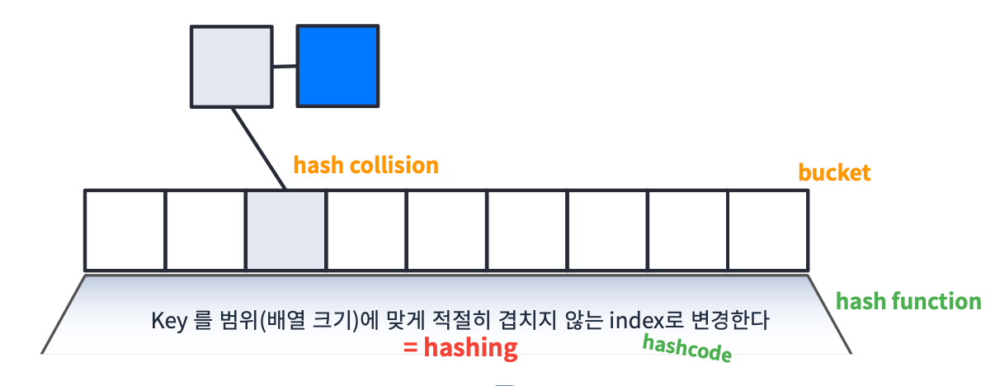
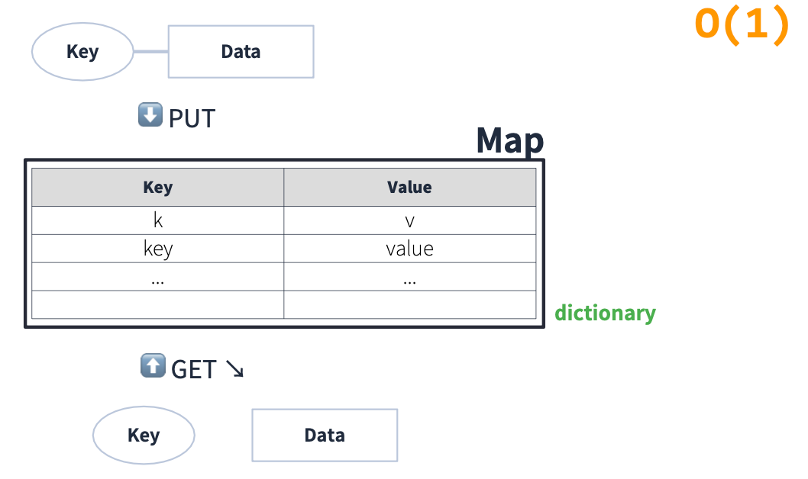

# Map
## Array + List
### Array와 List의 장단점
> [Array와 List의 장단점](https://velog.io/@hh7141/Java-Array%EC%99%80-List)
- Array: 인덱스로 빠르게 읽기는 좋은데 유연하지 못하다.
- List: 유연하기는 하지만 인덱스로 빠르게 읽지 못한다.
> 유연하면서도 빠르게 읽어내는 것은 없을까?
## Map
- Map: 빠른 데이터 접근과 유연한 확장이 가능하다.
### Map 원리

- bucket: Array를 의미한다.
- hashing: Key를 범위(배열의 크기)에 맞게 적절히 겹치지 않은 index로 변경한다.
- hash function: hashing 기능을 수행하는 함수이다.
- hashcode: 객체를 hash function에 넣어서 얻은 정수이다.
- hash collision: 서로 다른 key가 같은 hash 값을 가지면 충돌이 일어난다.
  - 하지만 List로 연결할 수 있기 때문에 같은 hash 값을 가질 수 있다.
> 정리
> Key -> hash function -> hash -> bucket index -> List -> Data


- Map은 dictionary 라고도 부른다.
## Java에서 Map 사용
### Hashtable
- Java에서 Map은 `Hashtable<K,V>` 클래스로 제공해준다. 관련된 문서는 [Java Api Docs](https://docs.oracle.com/javase/8/docs/api/)에 나와있다.
- `HashTable` 클래스는 `Map` 인터페이스를 implement한다. 
  - 따라서 `Map<String, Integer> map = new HashMap<>()` 식으로 많이 사용한다.
> **주요 Method**
> - `get(Object key)`: 해당 key가 매핑되어 있는 value를 return
> - `put(K key, V value)`: hashtable에 해당 key와 value를 매핑
> - `putAll(Map<? extends K,? extends V> t)`: 다른 맵에 있는 요소들을 모두 집어넣음
> - `getOrDefault(Object key, V defaultValue)`: 해당 key가 매핑되어 있는 value가 없다면 defaultValue를 return
> - `putIfAbsent(K key, V value)` 해당 key값에 매핑되어 있는 value가 있다면 삭제하고 새 value를 매핑
> - `remove(Object key)`: 해당 key와 그 key에 매핑되어 있는 value를 모두 지움
> - `replace(K key, V value)`: 해당 key값에 매핑되어 있는 값을 new value로 바꿈
> - `values()`, `keys()`: value들과 key들을 모두 반환
>   - `Map` 인터페이스에 정의된 `keySet()` 도 가능
- 위에 있는 메서드들 외에도 다양한 메서드들과 반환 타입이 다른 메서드들이 존재하기 때문에 [Java Api Docs](https://docs.oracle.com/javase/8/docs/api/) 을 참고하면 좋다. 
### HashMap
- `HashMap<K,V>` 클래스 또한 `Map` 인터페이스를 implement한다.

### Hashtable vs HashMap
- `Hashtable`과 `HashMap` 모두 `Map`클래스를 implement 하기 때문에 둘다 `Map`타입으로 많이 표현한다.
  - ```java
    Map<String, Integer> map = new HashMap<>();
    Map<String, Integer> map = new Hashtable<>();
    ```
- `Hashtable`과 `HashMap`은 많은 부분이 비슷하지만 synchronize(동기화) 에서 차이가 있다.
- 따라서 thread-safe한 구현을 원한다면 `HashMap`, 그렇지 않다면 `Hashtable`를 사용하는 것을 추천한다.
> **thread-saf**e: 여러 스레드로부터 동시에 접근되어도 안전하게 사용할 수 있는 속성
- 하지만 `Hashtable`를 사용해서 synchronized 되어 있으면 병목현상이 발생할 수 있다.
- 따라서 thread-safe 해야하고 highly-concurrency(많은 동시성)이 요구된다면 `ConcurrentHashMap`을 사용하는 것이 좋다.
> **정리**
> - `HashMap`: not synchronized
> - `Hashtable`: synchronized
> - `ConcurrentHashMap`: synchronized + high concurrency

### Custom Data를 Key로 사용할 때
```java
class MyData {
    int v;
    
    public MyData(int v) {
        this.v = v;
    }
    
    @Override
    public int hashCode() {
        return Object.hash(v);
    }
}
```
- 위와 같이 `hashcode()` 함수를 override 해서 `v`를 hash하도록 변경할 수 있다.

### 문제1
**문제 설명** <br>
당신은 폰켓몬을 잡기 위한 오랜 여행 끝에, 홍 박사님의 연구실에 도착했습니다. 홍 박사님은 당신에게 자신의 연구실에 있는 총 N 마리의 폰켓몬 중에서 N/2마리를 가져가도 좋다고 했습니다. <br>
홍 박사님 연구실의 폰켓몬은 종류에 따라 번호를 붙여 구분합니다. 따라서 같은 종류의 폰켓몬은 같은 번호를 가지고 있습니다. 예를 들어 연구실에 총 4마리의 폰켓몬이 있고, 각 폰켓몬의 종류 번호가 [3번, 1번, 2번, 3번]이라면 이는 3번 폰켓몬 두 마리, 1번 폰켓몬 한 마리, 2번 폰켓몬 한 마리가 있음을 나타냅니다. 이때, 4마리의 폰켓몬 중 2마리를 고르는 방법은 다음과 같이 6가지가 있습니다. <br>

첫 번째(3번), 두 번째(1번) 폰켓몬을 선택 <br>
첫 번째(3번), 세 번째(2번) 폰켓몬을 선택 <br>
첫 번째(3번), 네 번째(3번) 폰켓몬을 선택 <br>
두 번째(1번), 세 번째(2번) 폰켓몬을 선택 <br>
두 번째(1번), 네 번째(3번) 폰켓몬을 선택 <br>
세 번째(2번), 네 번째(3번) 폰켓몬을 선택 <br>
이때, 첫 번째(3번) 폰켓몬과 네 번째(3번) 폰켓몬을 선택하는 방법은 한 종류(3번 폰켓몬 두 마리)의 폰켓몬만 가질 수 있지만, 다른 방법들은 모두 두 종류의 폰켓몬을 가질 수 있습니다. 따라서 위 예시에서 가질 수 있는 폰켓몬 종류 수의 최댓값은 2가 됩니다. <br>
당신은 최대한 다양한 종류의 폰켓몬을 가지길 원하기 때문에, 최대한 많은 종류의 폰켓몬을 포함해서 N/2마리를 선택하려 합니다. N마리 폰켓몬의 종류 번호가 담긴 배열 nums가 매개변수로 주어질 때, N/2마리의 폰켓몬을 선택하는 방법 중, 가장 많은 종류의 폰켓몬을 선택하는 방법을 찾아, 그때의 폰켓몬 종류 번호의 개수를 return 하도록 solution 함수를 완성해주세요. <br>

**제한사항** <br>
nums는 폰켓몬의 종류 번호가 담긴 1차원 배열입니다.<br>
nums의 길이(N)는 1 이상 10,000 이하의 자연수이며, 항상 짝수로 주어집니다.<br>
폰켓몬의 종류 번호는 1 이상 200,000 이하의 자연수로 나타냅니다.<br>
가장 많은 종류의 폰켓몬을 선택하는 방법이 여러 가지인 경우에도, 선택할 수 있는 폰켓몬 종류 개수의 최댓값 하나만 return 하면 됩니다.<br>

**입출력 예** 

| nums | result |
| --- | --- |
| [3,1,2,3] | 2 |
| [3,3,3,2,2,4] | 3 |
| [3,3,3,2,2,2] | 2 |

**입출력 예 설명** <br>
입출력 예 #1 <br>
문제의 예시와 같습니다.<br>

**입출력 예 #2**<br>
6마리의 폰켓몬이 있으므로, 3마리의 폰켓몬을 골라야 합니다.<br>
가장 많은 종류의 폰켓몬을 고르기 위해서는 3번 폰켓몬 한 마리, 2번 폰켓몬 한 마리, 4번 폰켓몬 한 마리를 고르면 되며, 따라서 3을 return 합니다.<br>

**입출력 예 #3**<br>
6마리의 폰켓몬이 있으므로, 3마리의 폰켓몬을 골라야 합니다.<br>
가장 많은 종류의 폰켓몬을 고르기 위해서는 3번 폰켓몬 한 마리와 2번 폰켓몬 두 마리를 고르거나, 혹은 3번 폰켓몬 두 마리와 2번 폰켓몬 한 마리를 고르면 됩니다. 따라서 최대 고를 수 있는 폰켓몬 종류의 수는 2입니다.<br>

```java
import java.util.*;

class Solution {
    public int solution(int[] nums) {
        Map<Integer, Integer> map = new HashMap<>();
        for(int n : nums) {
            map.put(n, 0);
        }
        int kind = map.keySet().size();
        int N = nums.length / 2;
        
        return Math.min(kind, N);
    }
}
```

### 문제2

**문제 설명** <br>
수많은 마라톤 선수들이 마라톤에 참여하였습니다. 단 한 명의 선수를 제외하고는 모든 선수가 마라톤을 완주하였습니다.

마라톤에 참여한 선수들의 이름이 담긴 배열 participant와 완주한 선수들의 이름이 담긴 배열 completion이 주어질 때, 완주하지 못한 선수의 이름을 return 하도록 solution 함수를 작성해주세요.

**제한사항** <br>
마라톤 경기에 참여한 선수의 수는 1명 이상 100,000명 이하입니다. <br>
completion의 길이는 participant의 길이보다 1 작습니다.<br>
참가자의 이름은 1개 이상 20개 이하의 알파벳 소문자로 이루어져 있습니다.<br>
참가자 중에는 동명이인이 있을 수 있습니다.<br>

**입출력 예**<br>

| participant | completion | return   |
| --- | --- |----------|
| `["leo", "kiki", "eden"]` | `["eden", "kiki"]` | `"leo"`    |
| `["marina", "josipa", "nikola", "vinko", "filipa"]` | `["josipa", "filipa", "marina", "nikola"]` | `"vinko"`  |
| `["mislav", "stanko", "mislav", "ana"]` | `["stanko", "ana", "mislav"]` | `"mislav"` |

**입출력 예 설명** <br>
예제 #1 <br>
"leo"는 참여자 명단에는 있지만, 완주자 명단에는 없기 때문에 완주하지 못했습니다. <br>

예제 #2 <br>
"vinko"는 참여자 명단에는 있지만, 완주자 명단에는 없기 때문에 완주하지 못했습니다. <br>

예제 #3 <br>
"mislav"는 참여자 명단에는 두 명이 있지만, 완주자 명단에는 한 명밖에 없기 때문에 한명은 완주하지 못했습니다. <br>

```java
import java.util.*;

class Solution {
    public String solution(String[] participant, String[] completion) {
        Map<String, Integer> map = new HashMap<>();
        for(String p : participant) {
            map.put(p, map.getOrDefault(p, 0) + 1);
        }
        for(String c : completion) {
            int n = map.get(c) - 1;
            if(n == 0) map.remove(c);
            else map.put(c, n);
        }
        return map.keySet().iterator().next();
    }
}
```

### 문제3

**문제 설명** <br>
코니는 매일 다른 옷을 조합하여 입는것을 좋아합니다.

예를 들어 코니가 가진 옷이 아래와 같고, 오늘 코니가 동그란 안경, 긴 코트, 파란색 티셔츠를 입었다면 다음날은 청바지를 추가로 입거나 동그란 안경 대신 검정 선글라스를 착용하거나 해야합니다.

| 종류 | 이름 |
| --- | --- |
| 얼굴 | 동그란 안경, 검정 선글라스 |
| 상의 | 파란색 티셔츠 |
| 하의 | 청바지 |
| 겉옷 | 긴 코트 |

코니는 각 종류별로 최대 1가지 의상만 착용할 수 있습니다. 예를 들어 위 예시의 경우 동그란 안경과 검정 선글라스를 동시에 착용할 수는 없습니다. <br>
착용한 의상의 일부가 겹치더라도, 다른 의상이 겹치지 않거나, 혹은 의상을 추가로 더 착용한 경우에는 서로 다른 방법으로 옷을 착용한 것으로 계산합니다. <br>
코니는 하루에 최소 한 개의 의상은 입습니다.<br>
코니가 가진 의상들이 담긴 2차원 배열 clothes가 주어질 때 서로 다른 옷의 조합의 수를 return 하도록 solution 함수를 작성해주세요.<br>

**제한사항**<br>
clothes의 각 행은 [의상의 이름, 의상의 종류]로 이루어져 있습니다.<br>
코니가 가진 의상의 수는 1개 이상 30개 이하입니다.<br>
같은 이름을 가진 의상은 존재하지 않습니다.<br>
clothes의 모든 원소는 문자열로 이루어져 있습니다.<br>
모든 문자열의 길이는 1 이상 20 이하인 자연수이고 알파벳 소문자 또는 '_' 로만 이루어져 있습니다.<br>

**입출력 예**<br>

| clothes | return |
| --- | --- |
| `[["yellow_hat", "headgear"], ["blue_sunglasses", "eyewear"], ["green_turban", "headgear"]]` | 5 |
| `[["crow_mask", "face"], ["blue_sunglasses", "face"], ["smoky_makeup", "face"]]` | 3 |

**입출력 예 설명**<br>
**예제 #1**<br>
headgear에 해당하는 의상이 yellow_hat, green_turban이고 eyewear에 해당하는 의상이 blue_sunglasses이므로 아래와 같이 5개의 조합이 가능합니다.<br>
```
1. yellow_hat<br>
2. blue_sunglasses<br>
3. green_turban<br>
4. yellow_hat + blue_sunglasses<br>
5. green_turban + blue_sunglasses<br>
```

예제 #2<br>
face에 해당하는 의상이 crow_mask, blue_sunglasses, smoky_makeup이므로 아래와 같이 3개의 조합이 가능합니다.<br>
```
1. crow_mask<br>
2. blue_sunglasses<br>
3. smoky_makeup<br>
```

```java
import java.util.*;

class Solution {
    public int solution(String[][] clothes) {
        Map<String, Integer> map = new HashMap<>();
        
        for(String[] c : clothes) {
            map.put(c[1], map.getOrDefault(c[1], 0) + 1);
        }
        
        int answer = 1;
        for(int value : map.values()) {
            // 각 의상 종류 개수 + 1 (착용 + 미착용)
            answer *= value + 1;
        }
        
        // - 1 (모두 착용 안하는 경우 빼기)
        return answer - 1;
    }
}
        /* 이것도 가능
        var iter = map.values.iterator();
        while(iter.hasNext()) {
            answer *= iter.next() + 1;
        }
        */
```