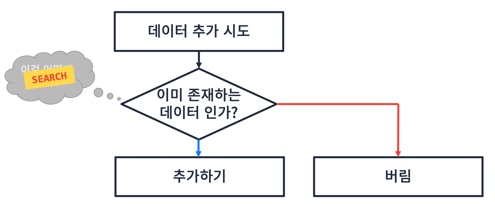
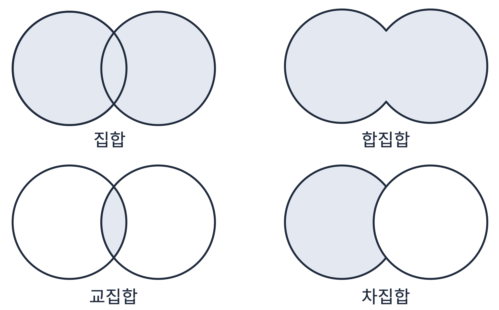

# Set
## 선형 데이터구조 + 탐색 알고리즘 
### 입력에 규칙 적용하기
- 규칙: 중복된 값을 허용하지 않는다

- set은 집합이며 합집합, 교집합, 차집합을 표현할 수 있다


## Java에서 Set 사용
### HashSet
- `HashSet<E>` 클래스는 `Set` 인터페이스를 implement한다.
  - 따라서 `Set<Integer> set = new HashSet<>();` 식으로 많이 사용한다.
- `HashSet`은 `HashMap`을 이용해서 구현되어 있다.
- `HashSet`은 중복된 값을 허용하지 않는다.
- `HashSet`은 순서를 보장하지 않는다.
- `HashSet`에서 사용하는 메서드들은 [Java Api Docs](https://docs.oracle.com/javase/8/docs/api/) 에서 확인할 수 있다.
### LinkedHashSet
- `LinkedHashSet<E>` 클래스는 `HashSet` 클래스를 상속받아 구현되어 있다.
- `LinkedHashSet`에서 사용하는 메서드들은 [Java Api Docs](https://docs.oracle.com/javase/8/docs/api/) 에서 확인할 수 있다.
### HashSet vs LinkedHashSet

> 다음 내용은 chat gpt 검색 결과이다.

자바에서 `HashSet`과 `LinkedHashSet`은 모두 Set 인터페이스를 구현한 클래스들이지만, 두 클래스는 내부적으로 데이터를 저장하고 관리하는 방식에서 차이가 있습니다. 이 차이로 인해 두 클래스의 성능 특성 및 사용 용도가 다릅니다. 아래에서 이 두 클래스의 주요 차이점을 설명하겠습니다.

**HashSet**
- **기본 구조**: `HashSet`은 해시 테이블(Hash Table)을 기반으로 데이터를 저장합니다.
- **순서 보장 여부**: `HashSet`은 요소들의 순서를 보장하지 않습니다. 즉, 삽입된 순서와 무관하게 요소들이 저장됩니다.
- **성능**: 요소의 추가, 삭제, 탐색 연산의 평균 시간 복잡도는 O(1)입니다. 해시 충돌이 발생하면 성능이 저하될 수 있습니다.
- **사용 예**: 요소의 순서가 중요하지 않고, 빠른 조회가 필요한 경우에 사용합니다.

```java
HashSet<String> hashSet = new HashSet<>();
hashSet.add("apple");
hashSet.add("banana");
hashSet.add("cherry");
System.out.println(hashSet); // 출력 결과는 삽입 순서와 무관함
```

**LinkedHashSet**
- **기본 구조**: `LinkedHashSet`은 해시 테이블과 이중 연결 리스트(Doubly Linked List)를 조합하여 데이터를 저장합니다.
- **순서 보장 여부**: `LinkedHashSet`은 요소들이 삽입된 순서를 유지합니다. 따라서, 저장된 요소들은 삽입된 순서대로 반복됩니다.
- **성능**: 요소의 추가, 삭제, 탐색 연산의 평균 시간 복잡도는 O(1)이지만, 순서를 유지하기 위한 이중 연결 리스트의 오버헤드가 있습니다.
- **사용 예**: 요소의 순서가 중요하고, 중복을 허용하지 않으면서도 삽입 순서를 유지해야 하는 경우에 사용합니다.

```java
LinkedHashSet<String> linkedHashSet = new LinkedHashSet<>();
linkedHashSet.add("apple");
linkedHashSet.add("banana");
linkedHashSet.add("cherry");
System.out.println(linkedHashSet); // 출력 결과는 삽입 순서를 유지함
```

**요약**
- **순서 유지**: `HashSet`은 요소의 순서를 유지하지 않으며, `LinkedHashSet`은 삽입 순서를 유지합니다.
- **메모리 및 성능**: `LinkedHashSet`은 순서를 유지하기 위해 추가적인 메모리와 약간의 성능 오버헤드가 있습니다. `HashSet`은 순서 유지에 대한 오버헤드가 없기 때문에 메모리 사용량과 성능 면에서 더 효율적입니다.

이러한 특성들을 고려하여, 필요에 맞는 Set 구현체를 선택하면 됩니다. 순서가 필요 없는 경우 `HashSet`을, 순서가 중요한 경우 `LinkedHashSet`을 사용하면 됩니다.

### Set
- `set`인터페이스를 implement하고 있는 것은 `HashSet`, `LinkedHashSet`, `TreeSet` 등 여러 class들이 있다.
- `HashSet`은 `Hashtable`을 이용해서 구현, `LinkedHashSet`은 `LinkedList`를 이용해서 구현, `TreeSet`은 `binarySearchTree`를 이용해서 구현하고 있다.
- `Set`의 궁극적인 목적이 중복을 허용하지 않는 것이기 때문에 어떤 class를 사용하든 중복을 허용하지 않는다.
- 가장 많이 사용하는 class는 `HashSet`이다.

### Custom Data를 사용할 때
```java
class MyData {
    int v;
    
    public MyData(int v) {
        this.v = v;
    }
    
    @Override
    public int hashCode() {
        return Object.hash(v);
    }
}

public class Main {
    public static void main(String[] args) {
        Set<MyData> set = new HashSet<>();
        
        set.add(new MyData(1));
        set.add(new MyData(2));
        set.add(new MyData(3));

        set.add(new MyData(1));
        set.add(new MyData(2));
        set.add(new MyData(3));
        
        System.out.println(set);
    }
}
```
- 위와 같이 `hashcode()` 함수를 override 해서 `v`를 hash하도록 hashcode를 추가해주면 된다.

### 집합 표현하기
```java
Set<Integer> setA = new HashSet<>();
Set<Integer> setB = new HashSet<>();

// A
setA.add(1);
setA.add(2);
setA.add(3);

// B
setB.add(2);
setB.add(3);
setB.add(4);

// A+B 합집합
setA.addAll(setB);

// A-B 차집합
setA.removeAll(setB);

// A*B 교집합
setA.retainAll(setB);
```

### 문제1
**문제 설명**  <br>
로또복권의 번호는 1에서 45 사이의 값을 가진 6개의 숫자로 구성됩니다. <br>
로또복권을 신청하는 사용자들은 OMR카드에 숫자를 마킹하여 신청을 하는데, 가끔 잘못 표시하여 신청하는 사용자들이 있습니다. <br>
로또복권에 등록 가능한 숫자조합인지 확인하는 기능을 작성해 주세요 <br>

입력1: `[4, 7, 32, 43, 22, 19]` <br>
출력1: `true`

6개의 숫자가 중복없이 1~45사이의 값을 가지고 로또복권 등록이 가능합니다.

입력2: `[3, 19, 34, 39, 39, 20]` <br>
출력2: `false`

6개의 숫자 중 39가 중복되어 로또복권 등록이 불가능합니다.

**입출력 예** <br>
입력1: `[4, 7, 32, 43, 22, 19]` <br>
출력1: `true`

입력2: `[3, 19, 34, 39, 39, 20]` <br>
출력2: `false`

```java
import java.util.*;

class Solution {
    public boolean solution(int[] lotto) {
        Set<Integer> set = new HashSet<>();
        
        for(int n : lotto) {
            if(n < 1 || n > 45) return false;
            set.add(n);
        }
        
        return set.size() == lotto.length;
    }
}
```

### 문제2
**문제 설명** <br>
입력되는 단어가 순서대로 배치될 때 끝말잇기로 끝까지 이어지는지 확인하세요. <br>
끝말잇기는 사용했던 단어가 다시 사용되면 안됩니다. <br>
단어의 첫 글자는 앞 단어의 마지막 글자로 시작되어야 합니다. <br>
(단, 첫 단어의 첫 글자는 확인하지 않습니다.)

입력1: `["tank", "kick", "know", "wheel", "land", "dream"]` <br>
출력1: `true`

단어의 연결이 모두 이어지고, 중복되는 단어가 없었습니다.

입력2: `["tank", "kick", "know", "wheel", "land", "dream", "mother", "robot", "tank"]` <br>
출력2: `false`

사용되었던 tank 단어가 다시 사용되었습니다.

```java
import java.util.*;

class Solution {
    public boolean solution(String[] words) {
        Set<String> set = new HashSet<>();
        
        char last = words[0].charAt(words[0].length() - 1);
        set.add(words[0]);
            
        for(int i = 1; i < words.length; i++) {
            if(words[i].charAt(0) != last) return false; // 끝말이 안 이어지면 false
            if (!set.add(words[i])) return false; // 중복이면 false
            last = words[i].charAt(words[i].length() - 1); // 끝말 갱신
        }
        
        return true;
    }
}
```

### 문제3
**문제 설명** <br>
배열 arr가 주어집니다. 배열 arr의 각 원소는 숫자 0부터 9까지로 이루어져 있습니다. 이때, 배열 arr에서 연속적으로 나타나는 숫자는 하나만 남기고 전부 제거하려고 합니다. 단, 제거된 후 남은 수들을 반환할 때는 배열 arr의 원소들의 순서를 유지해야 합니다. 예를 들면,

arr = [1, 1, 3, 3, 0, 1, 1] 이면 [1, 3, 0, 1] 을 return 합니다. <br>
arr = [4, 4, 4, 3, 3] 이면 [4, 3] 을 return 합니다. <br>
배열 arr에서 연속적으로 나타나는 숫자는 제거하고 남은 수들을 return 하는 solution 함수를 완성해 주세요. <br>

**제한사항** <br>
배열 arr의 크기 : 1,000,000 이하의 자연수 <br>
배열 arr의 원소의 크기 : 0보다 크거나 같고 9보다 작거나 같은 정수 <br>

**입출력 예** <br>
| arr | answer |
| --- | --- |
| [1,1,3,3,0,1,1] | [1,3,0,1] |
| [4,4,4,3,3] | [4,3] |

**입출력 예 설명** <br>
입출력 예 #1,2 <br>
문제의 예시와 같습니다. <br>

```java
import java.util.*;

public class Solution {
    public int[] solution(int []arr) {
        List<Integer> list = new LinkedList<>();
        
        int last = arr[0];
        list.add(arr[0]);
        
        for(int n : arr) {
            if(n != last) {
                last = n;
                list.add(n);
            }
        }
        
        return list.stream().mapToInt(Integer::intValue).toArray();
    }
}
```