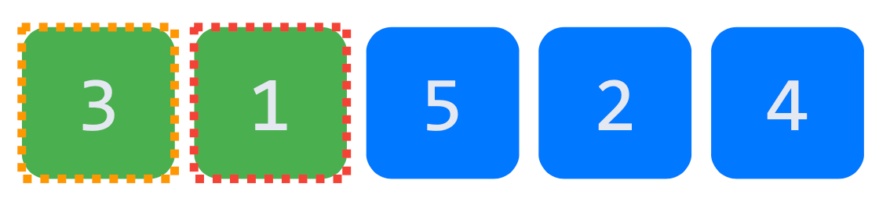
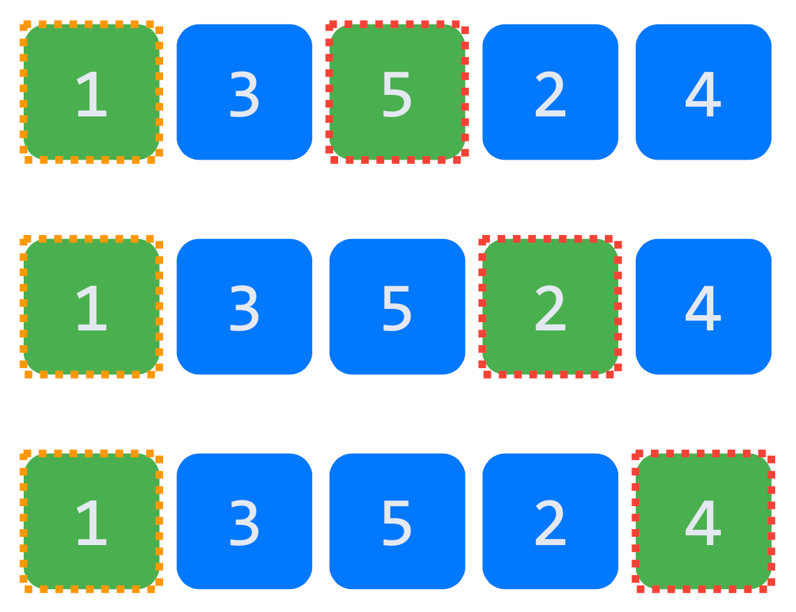
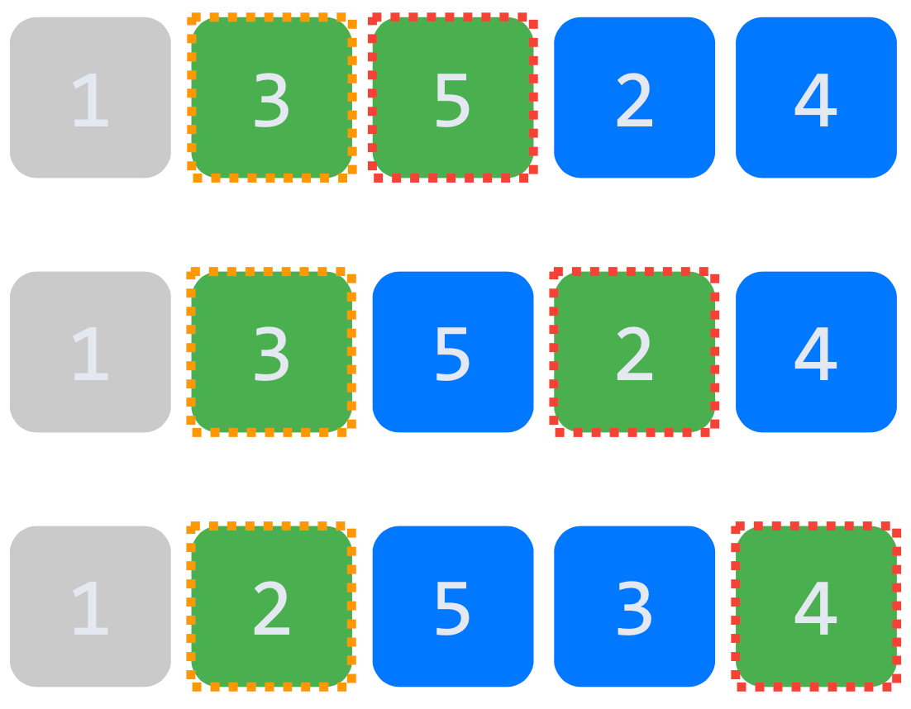
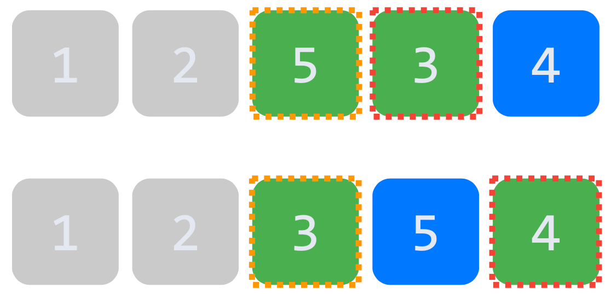
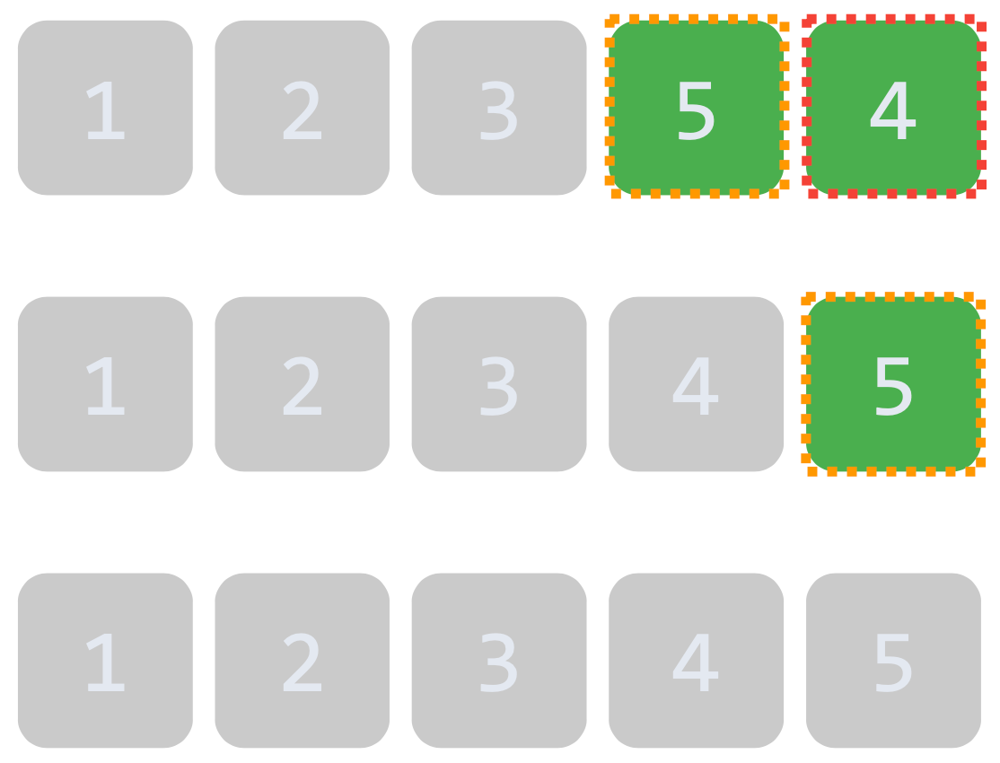
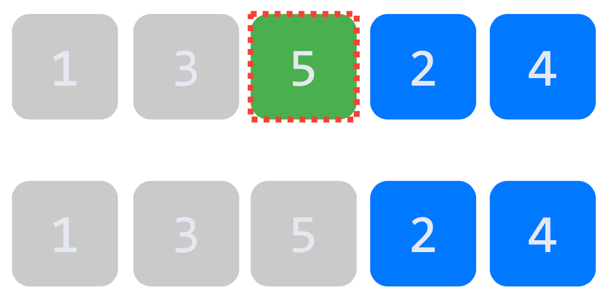
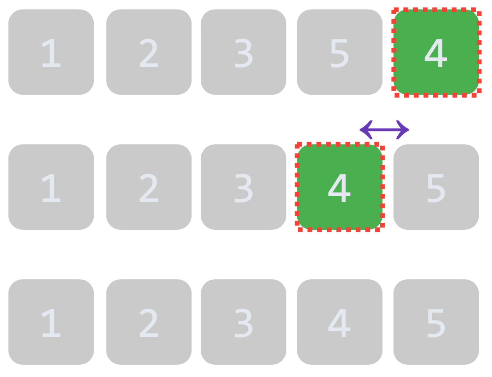

# Sort
## 정렬 (Sort) = 순서 바꾸기
- 정렬 알고리즘은 종류가 매우 많다.
- 그 중 정렬의 기초가 되는 알고리즘들을 소개한다.

### 1. Bubble Sort
- 가장 단순하고 무식한 방 (무식한 방법이 확실하지!)
- 두 원소의 크기를 비교해서 작은 것을 왼쪽에 둔다.
- ex) 3, 1, 5, 2, 4

  - 시간 복잡도: `O(n^2)`

### 2. Insertion Sort
- 값을 하나씩 옮겨가는 방식
- 지정한 원소의 왼쪽에 있는 원소들과 비교해서 작은 것을 왼쪽에 삽입한다.
- bubble sort 와 유사하지만 더 빠르다.
- ex) 3, 1, 5, 2, 4

  - 시간 복잡도: `O(n^2)`