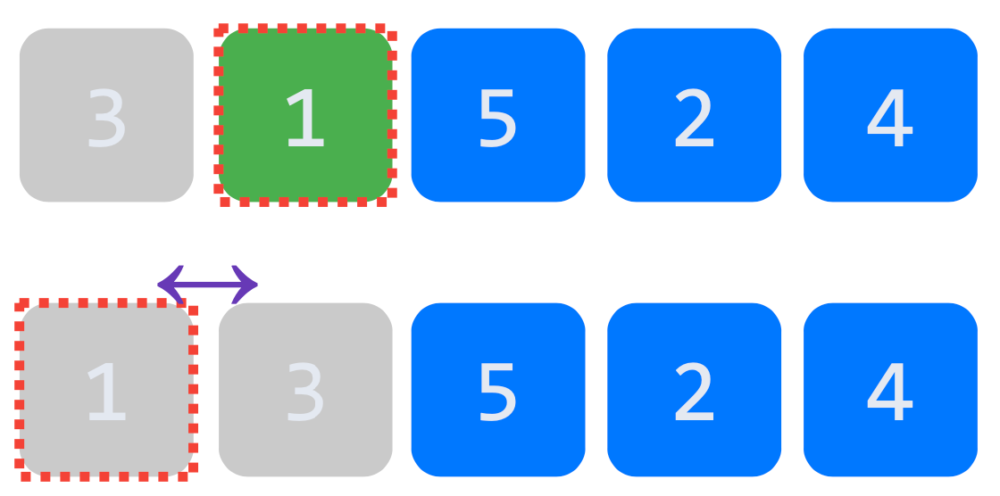
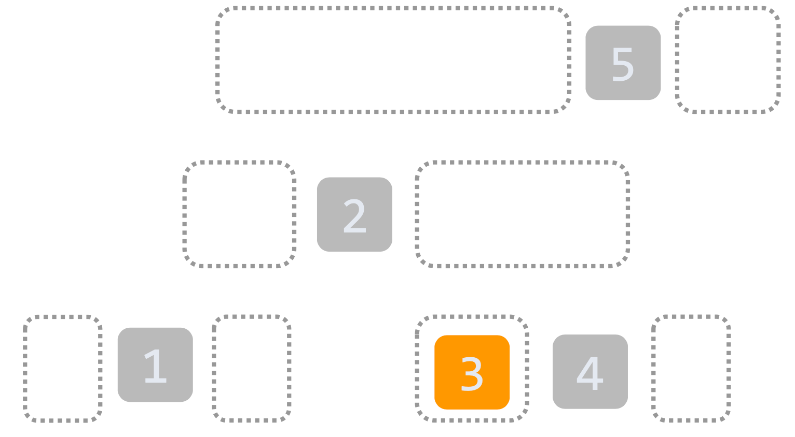

# Sort
## 정렬 (Sort) = 순서 바꾸기
- 정렬 알고리즘은 종류가 매우 많다.
- 그 중 정렬의 기초가 되는 알고리즘들을 소개한다.

### 1. Bubble Sort
- 가장 단순하고 무식한 방 (무식한 방법이 확실하지!)
- 두 원소의 크기를 비교해서 작은 것을 왼쪽에 둔다.
- ex) 3, 1, 5, 2, 4


  - 시간 복잡도: `O(n^2)`

### 2. Insertion Sort
- 삽입 정렬
- 값을 하나씩 옮겨가는 방식
- 지정한 원소의 왼쪽에 있는 원소들과 비교해서 작은 것을 왼쪽에 삽입한다.
- bubble sort 와 유사하지만 더 빠르다.
- ex) 3, 1, 5, 2, 4



  - 시간 복잡도: `O(n^2)`

### 3. Selection Sort
- 선택 정렬
- 최솟값을 찾아서 최솟값을 가장 왼쪽으로 옮기는 방식
- Bubble sort, Insertion sort 와 유사하게 모든 경우의 수를 확인
- ex) 3, 1, 5, 2, 4


  - 시간 복잡도: `O(n^2)`

### 4. Quick Sort
- 작은 것들, 큰 것들을 나누어서 합친다.
- pivot 값을 임의로 정해서 pivot 보다 작은 것은 왼쪽, 큰 것은 오른쪽으로 이동
- pivot 값을 기준으로 왼쪽, 오른쪽을 나누어서 정렬하기 때문에 비교해야 할 대상이 절반씩 줄어든다.
- ex) 3, 1, 5, 2, 4





  
  - 시간 복잡도: `O(nlogn)`

### 5. Merge Sort
- 병합 정렬
- 일단 나눴다가 작은 것 부터 합친다.
- 절반 씩 나누어서 정렬하고 합친다.
- ex) 3, 1, 5, 2, 4


  - 시간 복잡도: `O(nlogn)`

### 시간 복잡도 비교
- 컴퓨터 이론 적으로 정렬은 Best 케이스 제외하면 nlogn 보다 빠를 순 없다.


## Java에서의 정렬
```java
import java.util.*;

public class Main {
    public static void main(String[] args) {
        List<Integer> list = new LinkedList<>();

        Random r = new Random();
        for (int i = 0; i < 20; i++) {
            list.add(r.nextInt(50));
        }

        list.sort(Comparator.naturalOrder()); // 오름차순 정렬
        list.sort(Comparator.reverseOrder()); // 내림차순 정렬

        System.out.println(list);
    }
}
```
- `sort()`는 `List` 인터페이스에 정의되어 있다.
- `Comparator` 인터페이스를 이용해서 정렬 방법을 지정할 수 있다.
  - `sort(Comparator<? super E> c)`
- `Comparator`는 `compare()` 함수를 구현(implement)해야 한다.
```java
class MyData implements Comparable<MyData> {
  private int v;

  public MyData(int v) {
    this.v = v;
  }

  @Override
  public String toString() {
    return String.valueOf(v); // "" + v 보다 권장
  }

  @Override
  public int compareTo(MyData o) {
    // 오름 차순, naturalOrder와 reverseOrder 사용 가능
    return Integer.compare(v, o.v); // this.v - o.v 보다 권장
  }
}

public class Main {
  public static void main(String[] args) {
    List<MyData> list = new LinkedList<>();

    Random r = new Random();
    for (int i = 0; i < 20; i++) {
      list.add(new MyData(r.nextInt(50)));
    }

    list.sort(Comparator.naturalOrder()); // 오름차순
    list.sort(Comparator.reverseOrder()); // 내림차순

    System.out.println(list);
  }
}
```
- `compareTo()` 함수를 구현하여 대소관계를 정의해 주어야 `sort()` 함수를 사용할 수 있다.
- `sort()` 함수를 사용하여 정렬을 편하게 할 수 있다.
  - 어떤 알고리즘을 사용할 지는 `sort()` 함수 내부에서 결정된다.

> 🤔 왜 종류별로 알고리즘을 학습해야 하나?
> 1. 다양한 알고리즘을 학습하면서 문제풀이의 접근방식을 학습할 수 있다.
> 2. 문제를 해결하는 알고리즘은 한가지가 아니구나! 효율성이 달라지는구나! 절대적인 것은 없구나!
