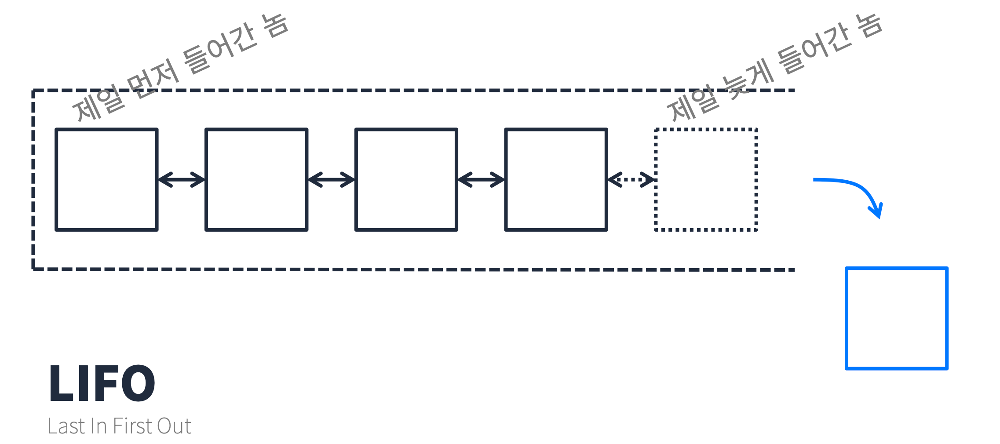
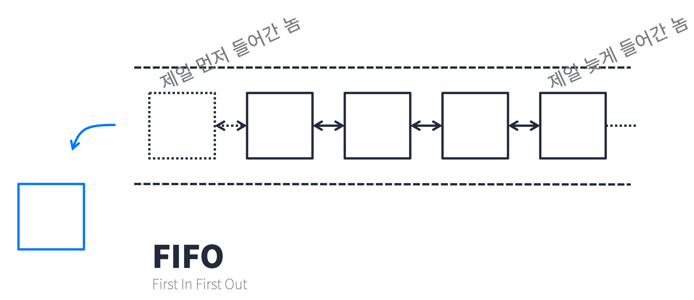

# Stack/Queue
## 출력에 규칙 적용
### 뒤에서 부터 꺼내기

> Stack

- LIFO(Last In First Out)
  - 제일 늦게 들어간 놈이 제일 먼저 나온다. 
  - 들어간 순서의 역순으로 데이터 조회


### 앞에서 부터 꺼내기

> Queue

- FIFO(First In First Out)
  - 제일 먼저 들어간 놈이 제일 먼저 나온다. 
  - 들어간 순서의 순방향으로 데이터 조회



## Java에서 Stack/Queue 사용
### Queue
- Java에서 Queue는 `Queue<E>` 인터페이스로만 제공해준다. 관련된 문서는 [Java Api Docs](https://docs.oracle.com/javase/8/docs/api/)에 나와있다.
- `Queue` 인터페이스는 `LinkedList`를 implement 하고있다. 
  - 따라서 `Queue<String> queue = new LinkedList<>()` 식으로 많이 사용한다.
- **Queue 메서드 요약**
  - `add(e)`, `remove()`, `element()`는 큐가 비어있을 때 예외를 발생시킨다.
  - `offer(e)`, `poll()`, `peek()`는 예외를 발생시키지 않고 특정 값을 반환한다. (ex. `null`)

|  | Throws exception | Returns special value |
| --- | --- | --- |
| **Insert** | `add(e)` | `offer(e)` |
| **Remove** | `remove()` | `poll()` |
| **Examine** | `element()` | `peek()` |

### Stack
- Java에서 Stack은 Queue와 달리 `Stack<E>` 클래스로 제공해준다. 관련된 문서는 [Java Api Docs](https://docs.oracle.com/javase/8/docs/api/)에 나와있다.
  - 따라서 `Stack<String> stack = new Stack<>()` 식으로 많이 사용한다.
- `Stack` 클래스는 `Vector` 클래스를 상속받고 있다.
- **Stack 메서드 요약**

| **Modifier and Type** | **Method** | **Description** |
| --- | --- | --- |
| **boolean** | `empty()` | Tests if this stack is empty. |
| **E** | `peek()` | Looks at the object at the top of this stack without removing it from the stack. |
| **E** | `pop()` | Removes the object at the top of this stack and returns that object as the value of this function. |
| **E** | `push(E item)` | Pushes an item onto the top of this stack. |
| **int** | `search(Object o)` | Returns the 1-based position where an object is on this stack. |

### Deque
- Stack과 Queue를 합친 자료구조로 앞, 뒤 양쪽에서 데이터를 넣고 뺄 수 있다.
  - Stack과 Queue는 데이터를 추가하면 뒤에서만 추가된다.
  - 꺼낼 때 Stack은 뒤에서, Queue는 앞에서 꺼낸다.
- Java에서 Deque는 Queue와 마찬가지로 `Deque<E>` 인터페이스로만 제공해준다. 관련된 문서는 [Java Api Docs](https://docs.oracle.com/javase/8/docs/api/)에 나와있다.
  - `Deque` 인터페이스는 `LinkedList`를 implement 하고있다. 
  - 따라서 `Deque<String> deque = new LinkedList<>()` 식으로 많이 사용한다.
- **Deque 메서드 요약**

|  | **First Element (Head)** | **First Element (Head)**    | **Last Element (Tail)** | **Last Element (Tail)** | 
|---|---| --- | --- | --- |
|             | **Throws exception** | **Special value**        | **Throws exception** | **Special value** | 
| **Insert**  | `addFirst(e)`            | `offerFirst(e)` | `addLast(e)` | `offerLast(e)` | 
| **Remove**  | `removeFirst()`          | `pollFirst()` | `removeLast()` | `pollLast()` | 
| **Examine** | `getFirst()`             | `peekFirst()` | `getLast()` | `peekLast()` |

- **Queue와 Dequeu 메서드 비교**

| **Queue Method** | **Equivalent Deque Method** |
| --- | --- |
| `add(e)` | `addLast(e)` |
| `offer(e)` | `offerLast(e)` |
| `remove()` | `removeFirst()` |
| `poll()` | `pollFirst()` |
| `element()` | `getFirst()` |
| `peek()` | `peekFirst()` |

- **Stack과 Dequeu 메서드 비교**

| **Stack Method** | **Equivalent Deque Method** |
| --- | --- |
| `push(e)` | `addFirst(e)` |
| `pop()` | `removeFirst()` |
| `peek()` | `peekFirst()` |

> **Queue**: `offer`, `poll`, `peek` (들어간 순서대로) <br>
> **Stack**: `push`, `pop`, `peek` (들어간 반대로) <br>
> **Deque**: `offerFirst`, `pollFirst`, `peekFirst`, `offerLast`, `pollLast`, `peekLast` (양방향) <br>

### 문제1

- **문제 설명** 

괄호가 바르게 짝지어졌다는 것은 '(' 문자로 열렸으면 반드시 짝지어서 ')' 문자로 닫혀야 한다는 뜻입니다. 예를 들어

- "()()" 또는 "(())()" 는 올바른 괄호입니다. <br>
- ")()(" 또는 "(()(" 는 올바르지 않은 괄호입니다. <br>

'(' 또는 ')' 로만 이루어진 문자열 s가 주어졌을 때, 문자열 s가 올바른 괄호이면 true를 return 하고, 올바르지 않은 괄호이면 false를 return 하는 solution 함수를 완성해 주세요. <br>

- **제한사항**
  - 문자열 s의 길이 : 100,000 이하의 자연수 <br>
  - 문자열 s는 '(' 또는 ')' 로만 이루어져 있습니다. <br>

- 입출력 예

| s | answer |
| --- | --- |
| "()()" | true |
| "(())()" | true |
| ")()(" | false |
| "(()(" | false |

- 입출력 예 설명
입출력 예 #1,2,3,4 <br>
문제의 예시와 같습니다. <br>

```java
import java.util.*;

class Solution {
    boolean solution(String s) {
        Stack<Character> stack = new Stack<>(); 
        
        for(char c : s.toCharArray()) {
            if(c == '(') {
                stack.push(c);
            } else {
                if(stack.isEmpty()) return false;
                stack.pop();
            }
        }
        
        return stack.isEmpty() == true;
    }
}

// 굳이 stack을 사용하지 않고 개수가 늘어나고 줄어드는 것만 확인해도 됨
```

### 문제 2
- **문제 설명**

프로그래머스 팀에서는 기능 개선 작업을 수행 중입니다. 각 기능은 진도가 100%일 때 서비스에 반영할 수 있습니다.

또, 각 기능의 개발속도는 모두 다르기 때문에 뒤에 있는 기능이 앞에 있는 기능보다 먼저 개발될 수 있고, 이때 뒤에 있는 기능은 앞에 있는 기능이 배포될 때 함께 배포됩니다.

먼저 배포되어야 하는 순서대로 작업의 진도가 적힌 정수 배열 progresses와 각 작업의 개발 속도가 적힌 정수 배열 speeds가 주어질 때 각 배포마다 몇 개의 기능이 배포되는지를 return 하도록 solution 함수를 완성하세요.

- **제한 사항**
  - 작업의 개수(progresses, speeds배열의 길이)는 100개 이하입니다.
  - 작업 진도는 100 미만의 자연수입니다.
  - 작업 속도는 100 이하의 자연수입니다.
  - 배포는 하루에 한 번만 할 수 있으며, 하루의 끝에 이루어진다고 가정합니다. 예를 들어 진도율이 95%인 작업의 개발 속도가 하루에 4%라면 배포는 2일 뒤에 이루어집니다.

- **입출력 예**

| progresses | speeds | return |
| --- | --- | --- |
| [93, 30, 55] | [1, 30, 5] | [2, 1] |
| [95, 90, 99, 99, 80, 99] | [1, 1, 1, 1, 1, 1] | [1, 3, 2] 

- **입출력 예 설명**

**입출력 예 #1** <br>
첫 번째 기능은 93% 완료되어 있고 하루에 1%씩 작업이 가능하므로 7일간 작업 후 배포가 가능합니다. <br>
두 번째 기능은 30%가 완료되어 있고 하루에 30%씩 작업이 가능하므로 3일간 작업 후 배포가 가능합니다. 하지만 이전 첫 번째 기능이 아직 완성된 상태가 아니기 때문에 첫 번째 기능이 배포되는 7일째 배포됩니다. <br>
세 번째 기능은 55%가 완료되어 있고 하루에 5%씩 작업이 가능하므로 9일간 작업 후 배포가 가능합니다.<br>

따라서 7일째에 2개의 기능, 9일째에 1개의 기능이 배포됩니다.

**입출력 예 #2** <br>
모든 기능이 하루에 1%씩 작업이 가능하므로, 작업이 끝나기까지 남은 일수는 각각 5일, 10일, 1일, 1일, 20일, 1일입니다. 어떤 기능이 먼저 완성되었더라도 앞에 있는 모든 기능이 완성되지 않으면 배포가 불가능합니다.

따라서 5일째에 1개의 기능, 10일째에 3개의 기능, 20일째에 2개의 기능이 배포됩니다.