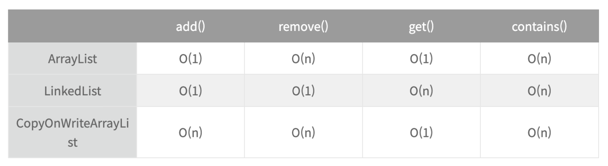
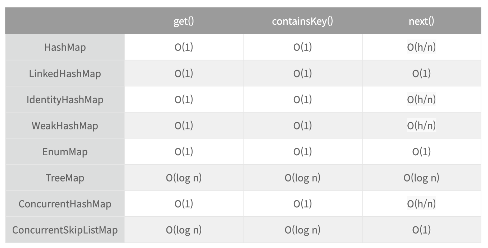
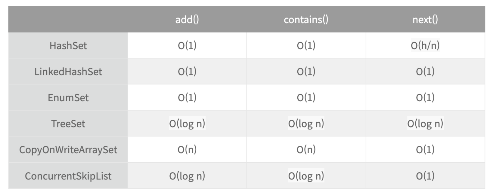
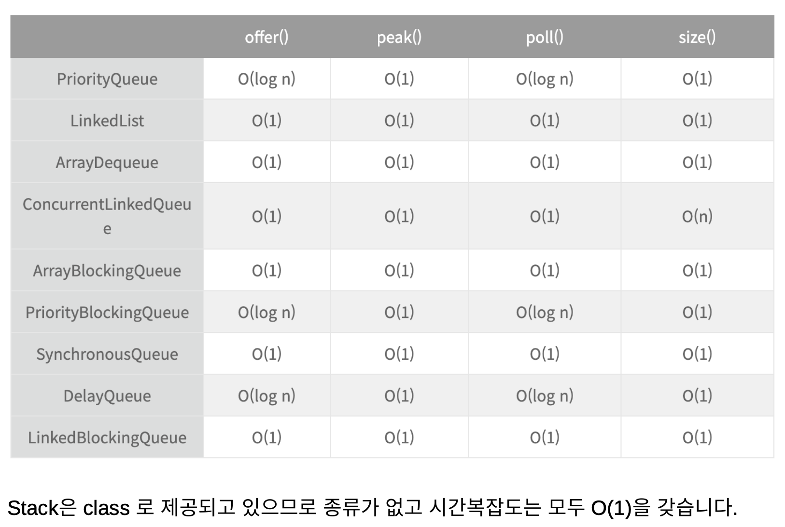

### List

### Map

### Set

### Stack/Queue

### Linear Search
- search 는 indexOf, contains, remove 같은 곳에서 이미 구현되어 있다.
  - O(n)
- 이진 탐색은 Collections.binarySearch Comparable 가 구현 되어야 한다. 순서대로 정렬되어 있어야 한다.
  - O(log n)