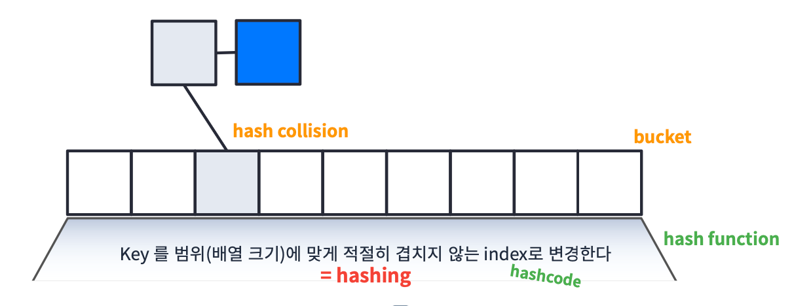

# Map
## Array + List
### Array와 List의 장단점
> [Array와 List의 장단점](https://velog.io/@hh7141/Java-Array%EC%99%80-List)
- Array: 인덱스로 빠르게 읽기는 좋은데 유연하지 못하다.
- List: 유연하기는 하지만 인덱스로 빠르게 읽지 못한.
> 유연하면서도 빠르게 읽어내는 것은 없을까?
## Map
- Map: 빠른 데이터 접근과 유연한 확장이 가능하다.
### Map 원리

- bucket: Array를 의미한다.
- hashing: Key를 범위(배열의 크기)에 맞게 적절히 겹치지 않은 index로 변경한다.
- hash function: hashing 기능을 수행하는 함수이다.
- hashcode: 객체를 hash function에 넣어서 얻은 정수이다.
- hash collision: 서로 다른 key가 같은 hash 값을 가지면 충돌이 일어난다.
  - 하지만 List로 연결할 수 있기 때문에 같은 hash 값을 가질 수 있다.
> 정리
> Key -> hash function -> hash -> bucket index -> List -> Data


- Map은 dictionary 라고도 부른다.
## Java에서 Map 사용
### Hashtable
- Java에서 Map은 `Hashtable<K,V>` 클래스로 제공해준다. 관련된 문서는 [Java Api Docs](https://docs.oracle.com/javase/8/docs/api/)에 나와있다.
- `HashTable` 클래스는 `Map` 인터페이스를 implemente한다. 
  - 따라서 `Map<String, Integer> map = new HashMap<>()` 식으로 많이 사용한다.
> 주요 Method
> - `get(Object key)`: 해당 key가 매핑되어 있는 value를 return
> - `put(K key, V value)`: hashtable에 해당 key와 value를 매핑
> - `putAll(Map<? extends K,? extends V> t)`: 다른 맵에 있는 요소들을 모두 집어넣음
> - `getOrDefault(Object key, V defaultValue)`: 해당 key가 매핑되어 있는 value가 없다면 defaultValue를 return
> - `putIfAbsent(K key, V value)` 해당 key값에 매핑되어 있는 value가 있다면 삭제하고 새 value를 매핑
> - `remove(Object key)`: 해당 key와 그 key에 매핑되어 있는 value를 모두 지움
> - `replace(K key, V value)`: 해당 key값에 매핑되어 있는 값을 new value로 바꿈
> - `values()`, `keys()`: value들과 key들을 모두 반환
>   - `Map` 인터페이스에 정의된 `keySet()` 도 가능
- 위에 있는 메서드들 외에도 다양한 메서드들과 반환 타입이 다른 메서드들이 존재하기 때문에 [Java Api Docs](https://docs.oracle.com/javase/8/docs/api/) 을 참고하면 좋다. 
### HashMap
- `HashMap<K,V>` 클래스 또한 `Map` 인터페이스를 implemente한다.

### Hashtable vs HashMap
- `Hashtable`과 `HashMap` 모두 `Map`클래스를 implemente 하기 때문에 둘다 `Map`타입으로 많이 표현한다.
  - ```java
    Map<String, Integer> map = new HashMap<>();
    Map<String, Integer> map = new Hashtable<>();
    ```
- `Hashtable`과 `HashMap`은 많은 부분이 비슷하지만 synchronize(동기화) 에서 차이가 있다.
- 따라서 thread-safe한 구현을 원한다면 `HashMap`, 그렇지 않다면 `Hashtable`를 사용하는 것을 추천한다.
> thread-safe: 여러 스레드로부터 동시에 접근되어도 안전하게 사용할 수 있는 속성
- 하지만 `Hashtable`를 사용해서 synchronized 되어 있으면 병목현상이 발생할 수 있다.
- 따라서 thread-safe 해야하고 highly-concurrency(많은 동시성)이 요구된다면 `ConcurrentHashMap`을 사용하는 것이 좋다.
> 정리
> - `HashMap`: not synchronized
> - `Hashtable`: synchronized
> - `ConcurrentHashMap`: synchronized + high concurrency

### Custom Data를 Key로 사용할 때
```java
class MyData {
    int v;
    
    public MyData(int v) {
        this.v = v;
    }
    
    @Override
    public int hashCode() {
        return Object.hash(v);
    }
}
```
- 위와 같이 `hashcode()` 함수를 override 해서 `v`를 hash하도록 변경할 수 있다.

